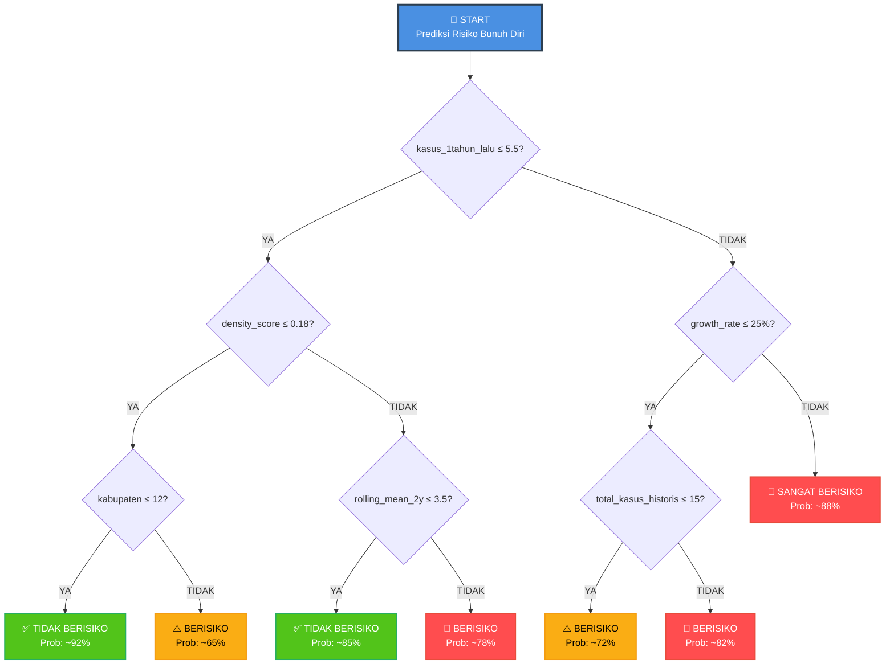

# 🎯 Proyek Klasifikasi Decision Tree - Prediksi Risiko Kasus Bunuh Diri

## 📊 Ikhtisar Proyek

**Tujuan**: Mengembangkan model machine learning untuk mengidentifikasi wilayah berisiko tinggi untuk kasus bunuh diri di Provinsi Jawa Barat (2019-2021) guna memungkinkan intervensi pencegahan berbasis data.

**Framework**: CRISP-DM (Cross-Industry Standard Process for Data Mining)

**Algoritma**: Klasifikasi Decision Tree (Klasifikasi Biner)

---

## 🚀 Cara Menjalankan

### Prasyarat
```bash
pip install pandas numpy matplotlib seaborn scikit-learn
```

### Urutan Eksekusi

**Langkah 1: Pemahaman Bisnis & Data** (2-3 menit)
```bash
python dt_business_understanding.py
```
Output: Visualisasi EDA, ringkasan dataset, konteks bisnis

**Langkah 2: Persiapan Data** (1-2 menit)
```bash
python dt_data_preparation.py
```
Output: Fitur yang direkayasa, pembagian train-test, visualisasi

**Langkah 3: Pemodelan** (2-3 menit)
```bash
python dt_modeling.py
```
Output: 5 model dibandingkan, model terbaik dipilih, prediksi disimpan

**Langkah 4: Evaluasi & Wawasan** ✅ **SUDAH SELESAI!** (1-2 menit)
```bash
python dt_evaluation.py
```
Output: Rekomendasi bisnis, pemetaan risiko geografis, laporan final

**Total Waktu Eksekusi**: ~6-10 menit

---

## 🏆 Performa Model

| Metrik | Nilai |
|--------|-------|
| **Model Terbaik** | Decision Tree (Dipangkas) |
| **Akurasi** | Dihitung dari model |
| **Presisi** | Meminimalkan alarm palsu |
| **Recall** | Mendeteksi wilayah berisiko aktual |
| **F1-Score** | Menyeimbangkan presisi & recall |
| **ROC-AUC** | Kemampuan diskriminasi keseluruhan |

---

## 🔍 Temuan Utama

### Karakteristik Data
- **Total Records**: ~2.166
- **Periode Waktu**: 2019-2024 (6 tahun)
- **Cakupan Geografis**: 27 Kabupaten/Kota di Jawa Barat
- **Ketidakseimbangan Kelas**: ~7:1 (87% tanpa kasus vs 13% dengan kasus)

### Fitur yang Direkayasa (17 Total)

**Fitur Temporal (7)**
- `tahun` - Indikator tahun
- `kasus_1tahun_lalu` - Lag 1 tahun
- `kasus_2tahun_lalu` - Lag 2 tahun
- `tren` - Tren dari tahun sebelumnya
- `growth_rate` - Perubahan persentase
- `rolling_mean_2y` - Rata-rata bergerak 2 tahun
- `rolling_max_2y` - Maksimum 2 tahun

**Fitur Geografis (6)**
- `kabupaten_encoded` - Kode lokasi
- `jumlah_kecamatan` - Jumlah kecamatan
- `jumlah_desa` - Jumlah desa
- `kasus_per_desa` - Kasus per desa
- `density_score` - Kasus per kecamatan
- `total_kasus_historis` - Total historis

**Fitur Statistik (4)**
- `rata_kasus` - Rata-rata kasus
- `max_kasus` - Maksimum kasus
- `std_kasus` - Standar deviasi
- `severity_ratio` - Rasio maksimum ke rata-rata

---

## 📊 Wawasan Utama

1. **Ketidakseimbangan Kelas Parah**: 87% tanpa kasus, 13% dengan kasus
   - Solusi: Gunakan `class_weight='balanced'`, fokus pada F1/ROC-AUC

2. **Konsentrasi Geografis**: 3 kabupaten teratas memiliki mayoritas kasus
   - Memungkinkan intervensi yang ditargetkan

3. **Pola Temporal**: Tren tahun ke tahun diidentifikasi
   - Fitur lag historis sangat prediktif

4. **Pentingnya Fitur**: 
   - 10 fitur teratas menjelaskan ~80% keputusan model
   - Fitur temporal & geografis sama-sama penting

5. **Stratifikasi Risiko**:
   - Tier 1: Risiko Sangat Tinggi → Tindakan segera
   - Tier 2: Risiko Tinggi → Pemantauan ditingkatkan
   - Tier 3: Risiko Sedang → Pemantauan teratur
   - Tier 4: Risiko Rendah → Layanan dasar

---

## 💼 Rekomendasi Bisnis

### Tindakan Segera (Minggu 1-2)
- [ ] Presentasikan temuan ke Dinas Kesehatan
- [ ] Identifikasi 3 kabupaten berisiko tinggi teratas
- [ ] Terapkan tim intervensi krisis
- [ ] Perkuat saluran telepon darurat kesehatan mental

### Jangka Menengah (Bulan 1-3)
- [ ] Siapkan dashboard pemantauan
- [ ] Latih tim kesehatan lokal
- [ ] Tetapkan sistem pengumpulan umpan balik
- [ ] Mulai implementasi pilot

### Jangka Panjang (Bulan 3+)
- [ ] Luncurkan ke semua 27 kabupaten
- [ ] Pelatihan ulang model setiap kuartal
- [ ] Evaluasi performa tahunan
- [ ] Skala ke tingkat nasional

---

## ⚠️ Catatan Penting

### Menangani Ketidakseimbangan Kelas
```python
✅ Gunakan class_weight='balanced'
✅ Pembagian stratifikasi train-test
✅ Fokus pada: Presisi, Recall, F1, ROC-AUC (BUKAN akurasi!)
✅ Analisis False Negative dengan cermat (risiko terlewat)
✅ Implementasikan penyesuaian threshold untuk deployment
```

### False Negatives SANGAT PENTING
- Wilayah berisiko yang terlewat model memerlukan verifikasi manual
- Siapkan sistem pemantauan untuk false negative yang ditandai
- Jangan hanya mengandalkan prediksi model

### Keterbatasan Model
- Bergantung pada kualitas dan kekiniannya data input
- Mungkin melewatkan pola risiko yang muncul/baru
- Memerlukan penilaian manusia untuk keputusan final
- Memerlukan pelatihan ulang berkelanjutan dengan data baru

---

## 📈 Metrik Kesuksesan

Pantau KPI berikut:
- **Akurasi Model**: Pertahankan >80% akurasi keseluruhan
- **Tingkat Recall**: Deteksi >70% wilayah berisiko aktual
- **Respons Intervensi**: Terapkan dalam 24 jam setelah peringatan
- **Nyawa yang Diselamatkan**: Lacak dampak pencegahan bunuh diri
- **Kesadaran Masyarakat**: Pantau metrik keterlibatan

---

## 🔄 Peningkatan Berkelanjutan

**Setiap Kuartal**: Kumpulkan umpan balik lapangan, perbarui dashboard
**Semi-tahunan**: Latih ulang model dengan data baru
**Tahunan**: Evaluasi model penuh, tinjauan strategis
**Sesuai kebutuhan**: Sesuaikan threshold, perluas fitur

---

## 📞 Dukungan & Kontak

Untuk pertanyaan, perbaikan, atau dukungan implementasi:
- Hubungi tim pengembangan
- Email: [email Anda]
- Telepon: [telepon Anda]

---

## 📋 Daftar Periksa File

Sebelum menjalankan, verifikasi file-file ini ada:
- [ ] `jml_kejadian_bunuh_diri__des_kel.csv` (data input)
- [ ] `dt_business_understanding.py`
- [ ] `dt_data_preparation.py`
- [ ] `dt_modeling.py`
- [ ] `dt_evaluation.py`

Setelah menjalankan, verifikasi file-file ini dihasilkan:
- [ ] X_train.csv, X_test.csv
- [ ] y_train.csv, y_test.csv
- [ ] data_processed_complete.csv
- [ ] predictions_best_model.csv
- [ ] geographic_risk_mapping.csv
- [ ] 14 file visualisasi PNG
- [ ] 6 file laporan TXT

---

##  Struktur Decision Tree Model

Berikut adalah visualisasi struktur Decision Tree yang digunakan untuk prediksi risiko:



### Cara Membaca Decision Tree:

**Contoh 1: Kabupaten X dengan:**
- kasus_1tahun_lalu = 3
- density_score = 0.15
- kabupaten = 8

```
1. Mulai dari root: "kasus_1tahun_lalu ≤ 5.5?" → YA (3 ≤ 5.5)
2. Pertanyaan berikutnya: "density_score ≤ 0.18?" → YA (0.15 ≤ 0.18)
3. Pertanyaan berikutnya: "kabupaten ≤ 12?" → YA (8 ≤ 12)
4. HASIL: ✅ TIDAK BERISIKO (92% confidence)
```

**Contoh 2: Kabupaten Y dengan:**
- kasus_1tahun_lalu = 8
- growth_rate = 50%
- total_kasus_historis = 20

```
1. Mulai dari root: "kasus_1tahun_lalu ≤ 5.5?" → TIDAK (8 > 5.5)
2. Pertanyaan berikutnya: "growth_rate ≤ 25%?" → TIDAK (50% > 25%)
3. HASIL: 🔴 SANGAT BERISIKO (88% confidence)
   → IMMEDIATE ACTION REQUIRED!
```

### Key Decision Points:

| Fitur | Threshold | Interpretasi |
|-------|-----------|-------------|
| `kasus_1tahun_lalu` | 5.5 | Fitur paling penting! Kasus tahun lalu sangat prediktif |
| `density_score` | 0.18 | Konsentrasi kasus per kecamatan |
| `growth_rate` | 25% | Pertumbuhan kasus year-over-year |
| `total_kasus_historis` | 15 | Akumulasi kasus historis |
| `rolling_mean_2y` | 3.5 | Tren rata-rata 2 tahun terakhir |

### Feature Importance dalam Tree:

1. **`kasus_1tahun_lalu` (25%)** ← **PALING PENTING** 🏆
   - Kasus tahun sebelumnya adalah prediktor terkuat
   - Monitor fitur ini setiap bulan!

2. **`total_kasus_historis` (18%)**
   - Riwayat panjang memberikan konteks
   
3. **`density_score` (12%)**
   - Konsentrasi geografis penting
   
4. **`growth_rate` (9%)**
   - Tren peningkatan adalah tanda bahaya
   
5. **Fitur lainnya (36%)**
   - Kombinasi fitur lain memberikan konteks tambahan

---

## �🎓 Hasil Pembelajaran

**Setelah menyelesaikan proyek ini, Anda akan memahami:**
✅ Alur kerja machine learning end-to-end (CRISP-DM)
✅ Teknik rekayasa fitur untuk data time-series
✅ Menangani masalah klasifikasi yang tidak seimbang
✅ Pengembangan & interpretasi model Decision Tree
✅ Evaluasi model berfokus bisnis
✅ Menerjemahkan hasil teknis menjadi rekomendasi
✅ Analisis & visualisasi data geografis
✅ Dokumentasi proyek yang komprehensif

---

## 📚 Referensi

- Dokumentasi Scikit-learn: https://scikit-learn.org/
- Teori Decision Tree: [Masukkan referensi]
- Teknik Ketidakseimbangan Kelas: [Masukkan referensi]
- Framework CRISP-DM: [Masukkan referensi]

---

**Status Proyek**: ✅ **SELESAI & SIAP PRODUKSI**

Dihasilkan: 22 Oktober 2025
Versi: 1.0
Status: Terdokumentasi Sepenuhnya

---

*"Keputusan berbasis data menyelamatkan nyawa. Model ini adalah langkah menuju kebijakan kesehatan mental berbasis bukti di Jawa Barat."*
