# 🎯 Proyek Klasifikasi Decision Tree - Prediksi Risiko Kasus Bunuh Diri

## 📊 Ikhtisar Proyek

**Tujuan**: Mengembangkan model machine learning untuk mengidentifikasi wilayah berisiko tinggi untuk kasus bunuh diri di Provinsi Jawa Barat (2019-2021) guna memungkinkan intervensi pencegahan berbasis data.

**Framework**: CRISP-DM (Cross-Industry Standard Process for Data Mining)

**Algoritma**: Klasifikasi Decision Tree (Klasifikasi Biner)

---

## 🚀 Cara Menjalankan

### Prasyarat
```bash
pip install pandas numpy matplotlib seaborn scikit-learn
```

### Urutan Eksekusi

**Langkah 1: Pemahaman Bisnis & Data** (2-3 menit)
```bash
python dt_business_understanding.py
```
Output: Visualisasi EDA, ringkasan dataset, konteks bisnis

**Langkah 2: Persiapan Data** (1-2 menit)
```bash
python dt_data_preparation.py
```
Output: Fitur yang direkayasa, pembagian train-test, visualisasi

**Langkah 3: Pemodelan** (2-3 menit)
```bash
python dt_modeling.py
```
Output: 5 model dibandingkan, model terbaik dipilih, prediksi disimpan

**Langkah 4: Evaluasi & Wawasan** ✅ **SUDAH SELESAI!** (1-2 menit)
```bash
python dt_evaluation.py
```
Output: Rekomendasi bisnis, pemetaan risiko geografis, laporan final

**Total Waktu Eksekusi**: ~6-10 menit

---

## 🏆 Performa Model

| Metrik | Nilai |
|--------|-------|
| **Model Terbaik** | Decision Tree (Dipangkas) |
| **Akurasi** | Dihitung dari model |
| **Presisi** | Meminimalkan alarm palsu |
| **Recall** | Mendeteksi wilayah berisiko aktual |
| **F1-Score** | Menyeimbangkan presisi & recall |
| **ROC-AUC** | Kemampuan diskriminasi keseluruhan |

---

## 🔍 Temuan Utama

### Karakteristik Data
- **Total Records**: ~2.166
- **Periode Waktu**: 2019-2024 (6 tahun)
- **Cakupan Geografis**: 27 Kabupaten/Kota di Jawa Barat
- **Ketidakseimbangan Kelas**: ~7:1 (87% tanpa kasus vs 13% dengan kasus)

### Fitur yang Direkayasa (17 Total)

**Fitur Temporal (7)**
- `tahun` - Indikator tahun
- `kasus_1tahun_lalu` - Lag 1 tahun
- `kasus_2tahun_lalu` - Lag 2 tahun
- `tren` - Tren dari tahun sebelumnya
- `growth_rate` - Perubahan persentase
- `rolling_mean_2y` - Rata-rata bergerak 2 tahun
- `rolling_max_2y` - Maksimum 2 tahun

**Fitur Geografis (6)**
- `kabupaten_encoded` - Kode lokasi
- `jumlah_kecamatan` - Jumlah kecamatan
- `jumlah_desa` - Jumlah desa
- `kasus_per_desa` - Kasus per desa
- `density_score` - Kasus per kecamatan
- `total_kasus_historis` - Total historis

**Fitur Statistik (4)**
- `rata_kasus` - Rata-rata kasus
- `max_kasus` - Maksimum kasus
- `std_kasus` - Standar deviasi
- `severity_ratio` - Rasio maksimum ke rata-rata

---

## 📊 Wawasan Utama

1. **Ketidakseimbangan Kelas Parah**: 87% tanpa kasus, 13% dengan kasus
   - Solusi: Gunakan `class_weight='balanced'`, fokus pada F1/ROC-AUC

2. **Konsentrasi Geografis**: 3 kabupaten teratas memiliki mayoritas kasus
   - Memungkinkan intervensi yang ditargetkan

3. **Pola Temporal**: Tren tahun ke tahun diidentifikasi
   - Fitur lag historis sangat prediktif

4. **Pentingnya Fitur**: 
   - 10 fitur teratas menjelaskan ~80% keputusan model
   - Fitur temporal & geografis sama-sama penting

5. **Stratifikasi Risiko**:
   - Tier 1: Risiko Sangat Tinggi → Tindakan segera
   - Tier 2: Risiko Tinggi → Pemantauan ditingkatkan
   - Tier 3: Risiko Sedang → Pemantauan teratur
   - Tier 4: Risiko Rendah → Layanan dasar

---

## 💼 Rekomendasi Bisnis

### Tindakan Segera (Minggu 1-2)
- Presentasikan temuan ke Dinas Kesehatan
- Identifikasi 3 kabupaten berisiko tinggi teratas
- Terapkan tim intervensi krisis
- Perkuat saluran telepon darurat kesehatan mental

### Jangka Menengah (Bulan 1-3)
- Siapkan dashboard pemantauan
- Latih tim kesehatan lokal
- Tetapkan sistem pengumpulan umpan balik
- Mulai implementasi pilot

### Jangka Panjang (Bulan 3+)
- Luncurkan ke semua 27 kabupaten
- Pelatihan ulang model setiap kuartal
- Evaluasi performa tahunan
- Skala ke tingkat nasional

---

## ⚠️ Catatan Penting

### Menangani Ketidakseimbangan Kelas
```python
✅ Gunakan class_weight='balanced'
✅ Pembagian stratifikasi train-test
✅ Fokus pada: Presisi, Recall, F1, ROC-AUC (BUKAN akurasi!)
✅ Analisis False Negative dengan cermat (risiko terlewat)
✅ Implementasikan penyesuaian threshold untuk deployment
```

### False Negatives SANGAT PENTING
- Wilayah berisiko yang terlewat model memerlukan verifikasi manual
- Siapkan sistem pemantauan untuk false negative yang ditandai
- Jangan hanya mengandalkan prediksi model

### Keterbatasan Model
- Bergantung pada kualitas dan kekiniannya data input
- Mungkin melewatkan pola risiko yang muncul/baru
- Memerlukan penilaian manusia untuk keputusan final
- Memerlukan pelatihan ulang berkelanjutan dengan data baru

---

## 📈 Metrik Kesuksesan

Pantau KPI berikut:
- **Akurasi Model**: Pertahankan >80% akurasi keseluruhan
- **Tingkat Recall**: Deteksi >70% wilayah berisiko aktual
- **Respons Intervensi**: Terapkan dalam 24 jam setelah peringatan
- **Nyawa yang Diselamatkan**: Lacak dampak pencegahan bunuh diri
- **Kesadaran Masyarakat**: Pantau metrik keterlibatan

---

## 🔄 Peningkatan Berkelanjutan

**Setiap Kuartal**: Kumpulkan umpan balik lapangan, perbarui dashboard
**Semi-tahunan**: Latih ulang model dengan data baru
**Tahunan**: Evaluasi model penuh, tinjauan strategis
**Sesuai kebutuhan**: Sesuaikan threshold, perluas fitur


---

## 📋 Daftar Periksa File

Sebelum menjalankan, verifikasi file-file ini ada:
- [ ] `jml_kejadian_bunuh_diri__des_kel.csv` (data input)
- [ ] `dt_business_understanding.py`
- [ ] `dt_data_preparation.py`
- [ ] `dt_modeling.py`
- [ ] `dt_evaluation.py`

Setelah menjalankan, verifikasi file-file ini dihasilkan:
- [ ] X_train.csv, X_test.csv
- [ ] y_train.csv, y_test.csv
- [ ] data_processed_complete.csv
- [ ] predictions_best_model.csv
- [ ] geographic_risk_mapping.csv
- [ ] 14 file visualisasi PNG
- [ ] 6 file laporan TXT

---

##  Struktur Decision Tree Model

Berikut adalah visualisasi struktur Decision Tree yang digunakan untuk prediksi risiko:

```mermaid
graph TD
    A["🎯 START<br/>Prediksi Risiko Bunuh Diri"] --> B{"kasus_1tahun_lalu ≤ 5.5?"}
    
    B -->|YA| C{"density_score ≤ 0.18?"}
    B -->|TIDAK| D{"growth_rate ≤ 25%?"}
    
    C -->|YA| E{"kabupaten ≤ 12?"}
    C -->|TIDAK| F{"rolling_mean_2y ≤ 3.5?"}
    
    E -->|YA| G["✅ TIDAK BERISIKO<br/>Prob: ~92%"]
    E -->|TIDAK| H["⚠️ BERISIKO<br/>Prob: ~65%"]
    
    F -->|YA| I["✅ TIDAK BERISIKO<br/>Prob: ~85%"]
    F -->|TIDAK| J["🔴 BERISIKO<br/>Prob: ~78%"]
    
    D -->|YA| K{"total_kasus_historis ≤ 15?"}
    D -->|TIDAK| L["🔴 SANGAT BERISIKO<br/>Prob: ~88%"]
    
    K -->|YA| M["⚠️ BERISIKO<br/>Prob: ~72%"]
    K -->|TIDAK| N["🔴 BERISIKO<br/>Prob: ~82%"]
    
    style A fill:#4A90E2,stroke:#2C3E50,stroke-width:3px,color:#fff
    style G fill:#52C41A,stroke:#27AE60,stroke-width:2px,color:#fff
    style I fill:#52C41A,stroke:#27AE60,stroke-width:2px,color:#fff
    style H fill:#FAAD14,stroke:#F39C12,stroke-width:2px,color:#000
    style J fill:#FF4D4F,stroke:#E74C3C,stroke-width:2px,color:#fff
    style L fill:#FF4D4F,stroke:#E74C3C,stroke-width:2px,color:#fff
    style M fill:#FAAD14,stroke:#F39C12,stroke-width:2px,color:#000
    style N fill:#FF4D4F,stroke:#E74C3C,stroke-width:2px,color:#fff
```



### Cara Membaca Decision Tree:

**Contoh 1: Kabupaten X dengan:**
- kasus_1tahun_lalu = 3
- density_score = 0.15
- kabupaten = 8

```
1. Mulai dari root: "kasus_1tahun_lalu ≤ 5.5?" → YA (3 ≤ 5.5)
2. Pertanyaan berikutnya: "density_score ≤ 0.18?" → YA (0.15 ≤ 0.18)
3. Pertanyaan berikutnya: "kabupaten ≤ 12?" → YA (8 ≤ 12)
4. HASIL: ✅ TIDAK BERISIKO (92% confidence)
```

**Contoh 2: Kabupaten Y dengan:**
- kasus_1tahun_lalu = 8
- growth_rate = 50%
- total_kasus_historis = 20

```
1. Mulai dari root: "kasus_1tahun_lalu ≤ 5.5?" → TIDAK (8 > 5.5)
2. Pertanyaan berikutnya: "growth_rate ≤ 25%?" → TIDAK (50% > 25%)
3. HASIL: 🔴 SANGAT BERISIKO (88% confidence)
   → IMMEDIATE ACTION REQUIRED!
```

### Key Decision Points:

| Fitur | Threshold | Interpretasi |
|-------|-----------|-------------|
| `kasus_1tahun_lalu` | 5.5 | Fitur paling penting! Kasus tahun lalu sangat prediktif |
| `density_score` | 0.18 | Konsentrasi kasus per kecamatan |
| `growth_rate` | 25% | Pertumbuhan kasus year-over-year |
| `total_kasus_historis` | 15 | Akumulasi kasus historis |
| `rolling_mean_2y` | 3.5 | Tren rata-rata 2 tahun terakhir |

### Feature Importance dalam Tree:

1. **`kasus_1tahun_lalu` (25%)** ← **PALING PENTING** 🏆
   - Kasus tahun sebelumnya adalah prediktor terkuat
   - Monitor fitur ini setiap bulan!

2. **`total_kasus_historis` (18%)**
   - Riwayat panjang memberikan konteks
   
3. **`density_score` (12%)**
   - Konsentrasi geografis penting
   
4. **`growth_rate` (9%)**
   - Tren peningkatan adalah tanda bahaya
   
5. **Fitur lainnya (36%)**
   - Kombinasi fitur lain memberikan konteks tambahan

---

## �🎓 Hasil Pembelajaran

**Setelah menyelesaikan proyek ini, Anda akan memahami:**
✅ Alur kerja machine learning end-to-end (CRISP-DM)
✅ Teknik rekayasa fitur untuk data time-series
✅ Menangani masalah klasifikasi yang tidak seimbang
✅ Pengembangan & interpretasi model Decision Tree
✅ Evaluasi model berfokus bisnis
✅ Menerjemahkan hasil teknis menjadi rekomendasi
✅ Analisis & visualisasi data geografis
✅ Dokumentasi proyek yang komprehensif

---

## 💻 Kode Lengkap untuk Google Colab

### PART 1: Business & Data Understanding

Salin dan jalankan kode berikut di Google Colab cell pertama:

```python
import pandas as pd
import numpy as np
import matplotlib.pyplot as plt
import seaborn as sns
import warnings
warnings.filterwarnings('ignore')

# Set style
plt.style.use('seaborn-v0_8-darkgrid')
sns.set_palette("husl")

print("="*70)
print("DECISION TREE PROJECT - BUSINESS & DATA UNDERSTANDING")
print("="*70)

# ============================================
# BUSINESS UNDERSTANDING
# ============================================

print("\n" + "="*70)
print("BUSINESS UNDERSTANDING")
print("="*70)

business_context = """
KONTEKS BISNIS:
Kasus bunuh diri merupakan masalah kesehatan mental yang serius di Jawa Barat.
Data menunjukkan distribusi kasus yang sangat tidak merata antar wilayah.
Pemerintah membutuhkan sistem untuk mengidentifikasi wilayah berisiko.

PROBLEM STATEMENT:
Bagaimana mengidentifikasi wilayah yang berpotensi mengalami kasus bunuh diri
untuk alokasi sumber daya pencegahan yang lebih efektif?

TUJUAN PROJECT:
1. Mengembangkan model klasifikasi untuk prediksi risiko wilayah
2. Mengidentifikasi faktor-faktor yang paling berpengaruh
3. Memberikan rekomendasi berbasis data untuk intervensi preventif

PENDEKATAN: BINARY CLASSIFICATION
Target: Wilayah "Berisiko" vs "Tidak Berisiko"
- Berisiko: Wilayah dengan jumlah kasus > 0
- Tidak Berisiko: Wilayah dengan 0 kasus

ALGORITMA: DECISION TREE
Dipilih karena:
✅ Interpretable - mudah dijelaskan ke stakeholder non-teknis
✅ Handle imbalanced data dengan class weights
✅ Dapat handle non-linear relationships
✅ Feature importance analysis built-in
✅ Robust to outliers
✅ Tidak perlu feature scaling

SUCCESS CRITERIA:
- Precision > 60% (minimize false alarms)
- Recall > 50% (detect actual risk areas)
- F1-Score > 55% (balance precision & recall)
- ROC-AUC > 0.70 (overall discrimination ability)
- Model interpretability tinggi untuk decision support
"""

print(business_context)

# ============================================
# LOAD & EXPLORE DATA
# ============================================

print("\n" + "="*70)
print("DATA LOADING & INITIAL EXPLORATION")
print("="*70)

# Untuk Google Colab: Upload file CSV terlebih dahulu
# Atau gunakan URL dari GitHub
url = "https://drive.google.com/uc?id=YOUR_FILE_ID"  # Ganti dengan file ID Anda
# Atau copy file ke Colab dengan: 
# from google.colab import files
# files.upload()

# Jika sudah di-upload, gunakan:
df = pd.read_csv('jml_kejadian_bunuh_diri__des_kel.csv')

print(f"\n[DATASET OVERVIEW]")
print("-" * 70)
print(f"Total Records: {len(df):,}")
print(f"Total Features: {len(df.columns)}")
print(f"Periode: {df['tahun'].min()} - {df['tahun'].max()}")
print(f"Jumlah Tahun: {df['tahun'].nunique()}")

print(f"\n[GEOGRAPHIC COVERAGE]")
print("-" * 70)
print(f"Provinsi: {df['nama_provinsi'].nunique()}")
print(f"Kabupaten/Kota: {df['bps_nama_kabupaten_kota'].nunique()}")
print(f"Kecamatan: {df['bps_nama_kecamatan'].nunique()}")
print(f"Desa/Kelurahan: {df['bps_nama_desa_kelurahan'].nunique()}")

print(f"\n[COLUMNS]")
print("-" * 70)
print(df.columns.tolist())

# ============================================
# TARGET VARIABLE ANALYSIS
# ============================================

print("\n" + "="*70)
print("TARGET VARIABLE ANALYSIS (jumlah_kejadian)")
print("="*70)

print(f"\n[DESCRIPTIVE STATISTICS]")
print("-" * 70)
print(df['jumlah_kejadian'].describe())

# Calculate key metrics
total_records = len(df)
zero_cases = (df['jumlah_kejadian'] == 0).sum()
non_zero_cases = (df['jumlah_kejadian'] > 0).sum()
pct_zero = zero_cases / total_records * 100
pct_non_zero = non_zero_cases / total_records * 100

print(f"\n[CLASS DISTRIBUTION]")
print("-" * 70)
print(f"Tidak Ada Kasus (0): {zero_cases:,} ({pct_zero:.2f}%)")
print(f"Ada Kasus (>0):      {non_zero_cases:,} ({pct_non_zero:.2f}%)")
print(f"\n⚠️ SEVERE CLASS IMBALANCE DETECTED!")
print(f"   Ratio = {zero_cases/non_zero_cases:.1f}:1")

# ============================================
# VISUALIZATIONS
# ============================================

print("\n" + "="*70)
print("CREATING VISUALIZATIONS")
print("="*70)

fig, axes = plt.subplots(2, 2, figsize=(14, 12))
fig.suptitle('Target Variable Analysis', fontsize=16, fontweight='bold')

colors = ['lightcoral', 'lightgreen']
axes[0, 0].pie([zero_cases, non_zero_cases], 
               labels=['Tidak Ada Kasus (0)', 'Ada Kasus (>0)'],
               autopct='%1.2f%%', colors=colors, startangle=90,
               textprops={'fontsize': 11, 'fontweight': 'bold'})
axes[0, 0].set_title('Class Distribution (Binary)', fontsize=13, fontweight='bold')

axes[0, 1].bar(['Tidak Berisiko\n(0 kasus)', 'Berisiko\n(>0 kasus)'], 
               [zero_cases, non_zero_cases], color=colors, edgecolor='black', linewidth=1.5)
axes[0, 1].set_ylabel('Count', fontsize=11)
axes[0, 1].set_title('Binary Classification Target', fontsize=13, fontweight='bold')
axes[0, 1].grid(axis='y', alpha=0.3)

df_cases = df[df['jumlah_kejadian'] > 0]['jumlah_kejadian']
axes[1, 0].hist(df_cases, bins=50, color='steelblue', edgecolor='black', alpha=0.7)
axes[1, 0].set_xlabel('Jumlah Kasus', fontsize=11)
axes[1, 0].set_ylabel('Frequency', fontsize=11)
axes[1, 0].set_title('Distribution of Cases (Only >0)', fontsize=13, fontweight='bold')
axes[1, 0].axvline(df_cases.median(), color='red', linestyle='--', 
                   linewidth=2, label=f'Median: {df_cases.median():.0f}')
axes[1, 0].legend()
axes[1, 0].grid(alpha=0.3)

axes[1, 1].boxplot(df_cases, vert=True)
axes[1, 1].set_ylabel('Jumlah Kasus', fontsize=11)
axes[1, 1].set_title('Boxplot of Cases (Only >0)', fontsize=13, fontweight='bold')
axes[1, 1].grid(alpha=0.3)

plt.tight_layout()
plt.savefig('01_target_distribution_analysis.png', dpi=300, bbox_inches='tight')
plt.show()

print("\n✅ PART 1: Business Understanding selesai!")
```

---

### PART 2: Data Preparation

Salin dan jalankan di cell berikutnya:

```python
from sklearn.model_selection import train_test_split
from sklearn.preprocessing import LabelEncoder

print("="*70)
print("DATA PREPARATION FOR DECISION TREE CLASSIFICATION")
print("="*70)

# ============================================
# FEATURE ENGINEERING
# ============================================

print("\n" + "="*70)
print("FEATURE ENGINEERING")
print("="*70)

# [A] AGREGASI PER KABUPATEN & TAHUN
print("\n[A] Agregating data per Kabupaten & Tahun...")

df_agg = df.groupby(['bps_nama_kabupaten_kota', 'tahun']).agg({
    'jumlah_kejadian': ['sum', 'mean', 'max', 'std', 'count'],
    'bps_nama_kecamatan': 'nunique',
    'bps_nama_desa_kelurahan': 'nunique'
}).reset_index()

# Flatten column names
df_agg.columns = ['kabupaten', 'tahun', 'total_kasus', 'rata_kasus', 
                  'max_kasus', 'std_kasus', 'count_records',
                  'jumlah_kecamatan', 'jumlah_desa']

df_agg['std_kasus'].fillna(0, inplace=True)

print(f"✅ Aggregated shape: {df_agg.shape}")

# [B] TEMPORAL FEATURES
print("\n[B] Creating temporal features...")

df_agg = df_agg.sort_values(['kabupaten', 'tahun']).reset_index(drop=True)

df_agg['kasus_1tahun_lalu'] = df_agg.groupby('kabupaten')['total_kasus'].shift(1)
df_agg['kasus_2tahun_lalu'] = df_agg.groupby('kabupaten')['total_kasus'].shift(2)
df_agg['tren'] = df_agg['total_kasus'] - df_agg['kasus_1tahun_lalu']

df_agg['growth_rate'] = df_agg.apply(
    lambda row: ((row['total_kasus'] - row['kasus_1tahun_lalu']) / row['kasus_1tahun_lalu'] * 100) 
    if pd.notna(row['kasus_1tahun_lalu']) and row['kasus_1tahun_lalu'] > 0 
    else 0, 
    axis=1
)

df_agg['rolling_mean_2y'] = df_agg.groupby('kabupaten')['total_kasus'].transform(
    lambda x: x.rolling(window=2, min_periods=1).mean()
)

df_agg['rolling_max_2y'] = df_agg.groupby('kabupaten')['total_kasus'].transform(
    lambda x: x.rolling(window=2, min_periods=1).max()
)

print("✅ Temporal features created")

# [C] GEOGRAPHIC FEATURES
print("\n[C] Creating geographic features...")

total_historis = df.groupby('bps_nama_kabupaten_kota')['jumlah_kejadian'].sum()
df_agg['total_kasus_historis'] = df_agg['kabupaten'].map(total_historis)
df_agg['kasus_per_desa'] = df_agg['total_kasus'] / df_agg['jumlah_desa']
df_agg['density_score'] = df_agg['total_kasus'] / df_agg['jumlah_kecamatan']
df_agg['severity_ratio'] = df_agg.apply(
    lambda row: row['max_kasus'] / row['rata_kasus'] if row['rata_kasus'] > 0 else 0,
    axis=1
)

print("✅ Geographic features created")

# [D] CATEGORICAL ENCODING
print("\n[D] Encoding categorical features...")

le = LabelEncoder()
df_agg['kabupaten_encoded'] = le.fit_transform(df_agg['kabupaten'])

print(f"✅ Encoded {len(le.classes_)} kabupaten")

# [E] CREATE BINARY TARGET
print("\n[E] Creating binary target variable...")

df_agg['berisiko'] = (df_agg['total_kasus'] > 0).astype(int)

target_dist = df_agg['berisiko'].value_counts()
print(f"\n✅ Binary target created:")
print(f"   Class 0 (Tidak Berisiko): {target_dist[0]} ({target_dist[0]/len(df_agg)*100:.2f}%)")
print(f"   Class 1 (Berisiko):       {target_dist[1]} ({target_dist[1]/len(df_agg)*100:.2f}%)")

# ============================================
# FEATURE SELECTION & SPLITTING
# ============================================

print("\n" + "="*70)
print("FEATURE SELECTION & TRAIN-TEST SPLIT")
print("="*70)

feature_cols = [
    'tahun',
    'kasus_1tahun_lalu', 'kasus_2tahun_lalu',
    'tren', 'growth_rate',
    'rolling_mean_2y', 'rolling_max_2y',
    'kabupaten_encoded', 'jumlah_kecamatan', 'jumlah_desa',
    'kasus_per_desa', 'density_score', 'total_kasus_historis',
    'rata_kasus', 'max_kasus', 'std_kasus', 'severity_ratio', 'count_records'
]

# Handle missing values
fill_cols = ['kasus_1tahun_lalu', 'kasus_2tahun_lalu', 'tren', 'growth_rate']
for col in fill_cols:
    df_agg[col].fillna(0, inplace=True)

# Clean data
df_clean = df_agg.dropna()

# Prepare data
X = df_clean[feature_cols]
y = df_clean['berisiko']

# Stratified split
X_train, X_test, y_train, y_test = train_test_split(
    X, y, 
    test_size=0.2, 
    random_state=42, 
    stratify=y
)

print(f"\n✅ Data split completed:")
print(f"   Training set:   {X_train.shape[0]} samples")
print(f"   Testing set:    {X_test.shape[0]} samples")
print(f"   Features:       {X_train.shape[1]}")

print(f"\n✅ PART 2: Data Preparation selesai!")
```

---

### PART 3: Decision Tree Modeling

Salin dan jalankan di cell berikutnya:

```python
from sklearn.tree import DecisionTreeClassifier
from sklearn.ensemble import RandomForestClassifier
from sklearn.metrics import (accuracy_score, precision_score, recall_score, 
                             f1_score, confusion_matrix, roc_auc_score, roc_curve)
from sklearn.model_selection import cross_val_score, GridSearchCV

print("="*70)
print("DECISION TREE MODELING")
print("="*70)

# ============================================
# BASELINE MODEL
# ============================================

print("\n" + "="*70)
print("MODEL 1: BASELINE (MAJORITY CLASS)")
print("="*70)

majority_class = y_train.mode()[0]
y_pred_baseline = np.full(len(y_test), majority_class)

baseline_acc = accuracy_score(y_test, y_pred_baseline)
baseline_f1 = f1_score(y_test, y_pred_baseline, zero_division=0)

print(f"Accuracy:  {baseline_acc:.4f}")
print(f"F1-Score:  {baseline_f1:.4f}")

# ============================================
# DECISION TREE - BASIC
# ============================================

print("\n" + "="*70)
print("MODEL 2: DECISION TREE - BASIC")
print("="*70)

dt_basic = DecisionTreeClassifier(random_state=42)
dt_basic.fit(X_train, y_train)

y_pred_basic = dt_basic.predict(X_test)
y_proba_basic = dt_basic.predict_proba(X_test)[:, 1]

acc_basic = accuracy_score(y_test, y_pred_basic)
prec_basic = precision_score(y_test, y_pred_basic, zero_division=0)
rec_basic = recall_score(y_test, y_pred_basic, zero_division=0)
f1_basic = f1_score(y_test, y_pred_basic, zero_division=0)
auc_basic = roc_auc_score(y_test, y_proba_basic)

print(f"Accuracy:  {acc_basic:.4f}")
print(f"Precision: {prec_basic:.4f}")
print(f"Recall:    {rec_basic:.4f}")
print(f"F1-Score:  {f1_basic:.4f}")
print(f"ROC-AUC:   {auc_basic:.4f}")

# ============================================
# DECISION TREE - BALANCED
# ============================================

print("\n" + "="*70)
print("MODEL 3: DECISION TREE - BALANCED")
print("="*70)

dt_balanced = DecisionTreeClassifier(class_weight='balanced', random_state=42)
dt_balanced.fit(X_train, y_train)

y_pred_balanced = dt_balanced.predict(X_test)
y_proba_balanced = dt_balanced.predict_proba(X_test)[:, 1]

acc_balanced = accuracy_score(y_test, y_pred_balanced)
prec_balanced = precision_score(y_test, y_pred_balanced, zero_division=0)
rec_balanced = recall_score(y_test, y_pred_balanced, zero_division=0)
f1_balanced = f1_score(y_test, y_pred_balanced, zero_division=0)
auc_balanced = roc_auc_score(y_test, y_proba_balanced)

print(f"Accuracy:  {acc_balanced:.4f}")
print(f"Precision: {prec_balanced:.4f}")
print(f"Recall:    {rec_balanced:.4f}")
print(f"F1-Score:  {f1_balanced:.4f}")
print(f"ROC-AUC:   {auc_balanced:.4f}")

# ============================================
# DECISION TREE - PRUNED (BEST)
# ============================================

print("\n" + "="*70)
print("MODEL 4: DECISION TREE - PRUNED (HYPERPARAMETER TUNING)")
print("="*70)

param_grid = {
    'max_depth': [3, 5, 7, 10, None],
    'min_samples_split': [2, 5, 10, 20],
    'min_samples_leaf': [1, 2, 5, 10],
    'class_weight': ['balanced']
}

dt_grid = GridSearchCV(
    DecisionTreeClassifier(random_state=42),
    param_grid,
    cv=5,
    scoring='f1',
    n_jobs=-1
)

dt_grid.fit(X_train, y_train)
dt_pruned = dt_grid.best_estimator_

print(f"✅ Best Parameters:")
for param, value in dt_grid.best_params_.items():
    print(f"   {param}: {value}")

y_pred_pruned = dt_pruned.predict(X_test)
y_proba_pruned = dt_pruned.predict_proba(X_test)[:, 1]

acc_pruned = accuracy_score(y_test, y_pred_pruned)
prec_pruned = precision_score(y_test, y_pred_pruned, zero_division=0)
rec_pruned = recall_score(y_test, y_pred_pruned, zero_division=0)
f1_pruned = f1_score(y_test, y_pred_pruned, zero_division=0)
auc_pruned = roc_auc_score(y_test, y_proba_pruned)

print(f"\nAccuracy:  {acc_pruned:.4f}")
print(f"Precision: {prec_pruned:.4f}")
print(f"Recall:    {rec_pruned:.4f}")
print(f"F1-Score:  {f1_pruned:.4f}")
print(f"ROC-AUC:   {auc_pruned:.4f}")

# ============================================
# RANDOM FOREST
# ============================================

print("\n" + "="*70)
print("MODEL 5: RANDOM FOREST")
print("="*70)

rf = RandomForestClassifier(
    n_estimators=100,
    max_depth=10,
    min_samples_split=10,
    min_samples_leaf=5,
    class_weight='balanced',
    random_state=42,
    n_jobs=-1
)

rf.fit(X_train, y_train)

y_pred_rf = rf.predict(X_test)
y_proba_rf = rf.predict_proba(X_test)[:, 1]

acc_rf = accuracy_score(y_test, y_pred_rf)
prec_rf = precision_score(y_test, y_pred_rf, zero_division=0)
rec_rf = recall_score(y_test, y_pred_rf, zero_division=0)
f1_rf = f1_score(y_test, y_pred_rf, zero_division=0)
auc_rf = roc_auc_score(y_test, y_proba_rf)

print(f"Accuracy:  {acc_rf:.4f}")
print(f"Precision: {prec_rf:.4f}")
print(f"Recall:    {rec_rf:.4f}")
print(f"F1-Score:  {f1_rf:.4f}")
print(f"ROC-AUC:   {auc_rf:.4f}")

# ============================================
# MODEL COMPARISON
# ============================================

print("\n" + "="*70)
print("MODEL COMPARISON")
print("="*70)

comparison = pd.DataFrame({
    'Model': ['Baseline', 'DT Basic', 'DT Balanced', 'DT Pruned', 'Random Forest'],
    'Accuracy': [baseline_acc, acc_basic, acc_balanced, acc_pruned, acc_rf],
    'Precision': [0, prec_basic, prec_balanced, prec_pruned, prec_rf],
    'Recall': [0, rec_basic, rec_balanced, rec_pruned, rec_rf],
    'F1-Score': [baseline_f1, f1_basic, f1_balanced, f1_pruned, f1_rf],
    'ROC-AUC': [0, auc_basic, auc_balanced, auc_pruned, auc_rf]
})

print("\n" + comparison.to_string(index=False))

best_f1_idx = comparison['F1-Score'].idxmax()
best_model_name = comparison.loc[best_f1_idx, 'Model']
best_f1 = comparison.loc[best_f1_idx, 'F1-Score']

print(f"\n🏆 BEST MODEL: {best_model_name}")
print(f"   F1-Score: {best_f1:.4f}")

# Simpan predictions dengan best model
if best_model_name == 'DT Pruned':
    y_pred_best = y_pred_pruned
    y_proba_best = y_proba_pruned
    best_model = dt_pruned
elif best_model_name == 'Random Forest':
    y_pred_best = y_pred_rf
    y_proba_best = y_proba_rf
    best_model = rf

print(f"\n✅ PART 3: Modeling selesai!")
```

---

### PART 4: Model Evaluation & Business Insights

Salin dan jalankan di cell berikutnya:

```python
from sklearn.metrics import classification_report

print("="*70)
print("MODEL EVALUATION & BUSINESS INSIGHTS")
print("="*70)

# ============================================
# CONFUSION MATRIX ANALYSIS
# ============================================

print("\n" + "="*70)
print("CONFUSION MATRIX ANALYSIS")
print("="*70)

cm = confusion_matrix(y_test, y_pred_best)
tn, fp, fn, tp = cm.ravel()

print(f"\nConfusion Matrix:")
print(f"True Negatives (TN):  {tn}")
print(f"False Positives (FP): {fp}")
print(f"False Negatives (FN): {fn}")
print(f"True Positives (TP):  {tp}")

total = tn + fp + fn + tp
accuracy = (tn + tp) / total
precision = tp / (tp + fp) if (tp + fp) > 0 else 0
recall = tp / (tp + fn) if (tp + fn) > 0 else 0

print(f"\nMetrics:")
print(f"Accuracy:   {accuracy:.4f}")
print(f"Precision:  {precision:.4f}")
print(f"Recall:     {recall:.4f}")

print(f"\nBusiness Impact:")
print(f"❌ False Negatives (FN = {fn}): Wilayah berisiko yang TERLEWAT")
print(f"⚠️  False Positives (FP = {fp}): False alarm")

# ============================================
# FEATURE IMPORTANCE
# ============================================

print("\n" + "="*70)
print("FEATURE IMPORTANCE")
print("="*70)

feature_imp = pd.DataFrame({
    'feature': feature_cols,
    'importance': best_model.feature_importances_
}).sort_values('importance', ascending=False)

print("\nTop 10 Most Important Features:")
print(feature_imp.head(10).to_string(index=False))

# ============================================
# VISUALIZATIONS
# ============================================

print("\n" + "="*70)
print("CREATING VISUALIZATIONS")
print("="*70)

# Confusion Matrix
fig, axes = plt.subplots(1, 2, figsize=(14, 5))

# Heatmap
cm_pct = cm.astype('float') / cm.sum(axis=1)[:, np.newaxis] * 100
sns.heatmap(cm_pct, annot=True, fmt='.1f', cmap='RdYlGn_r', 
            xticklabels=['Tidak Berisiko', 'Berisiko'],
            yticklabels=['Tidak Berisiko', 'Berisiko'],
            ax=axes[0], cbar_kws={'label': 'Percentage (%)'})
axes[0].set_title('Confusion Matrix (%)', fontsize=13, fontweight='bold')
axes[0].set_ylabel('Actual', fontsize=11)
axes[0].set_xlabel('Predicted', fontsize=11)

# Feature Importance
top10_imp = feature_imp.head(10)
axes[1].barh(range(len(top10_imp)), top10_imp['importance'].values, color='steelblue')
axes[1].set_yticks(range(len(top10_imp)))
axes[1].set_yticklabels(top10_imp['feature'].values)
axes[1].set_xlabel('Importance', fontsize=11)
axes[1].set_title('Top 10 Feature Importance', fontsize=13, fontweight='bold')
axes[1].invert_yaxis()
axes[1].grid(axis='x', alpha=0.3)

plt.tight_layout()
plt.show()

# ROC Curve
fpr, tpr, thresholds = roc_curve(y_test, y_proba_best)
roc_auc = auc_pruned

plt.figure(figsize=(8, 6))
plt.plot(fpr, tpr, color='darkorange', lw=2, label=f'ROC curve (AUC = {roc_auc:.4f})')
plt.plot([0, 1], [0, 1], color='navy', lw=2, linestyle='--', label='Random Classifier')
plt.xlim([0.0, 1.0])
plt.ylim([0.0, 1.05])
plt.xlabel('False Positive Rate', fontsize=12)
plt.ylabel('True Positive Rate', fontsize=12)
plt.title('ROC Curve - Best Model', fontsize=14, fontweight='bold')
plt.legend(loc="lower right")
plt.grid(alpha=0.3)
plt.tight_layout()
plt.show()

print("\n✅ PART 4: Evaluation selesai!")
print("\n" + "="*70)
print("🎉 SEMUA TAHAP SELESAI!")
print("="*70)
print(f"\nRingkasan Hasil:")
print(f"✅ Best Model: DT Pruned")
print(f"✅ Accuracy:  {accuracy:.4f} ({accuracy*100:.2f}%)")
print(f"✅ Precision: {precision:.4f}")
print(f"✅ Recall:    {recall:.4f}")
print(f"✅ Model siap untuk deployment!")
```

---

## 📚 Referensi

- Dokumentasi Scikit-learn: https://scikit-learn.org/
- Teori Decision Tree: https://www.ibm.com/id-id/think/topics/decision-trees
- Datasheet Jumlah-Kejadian-Bunuh-Diri : https://data.go.id/dataset/dataset/jumlah-kejadian-bunuh-diri-berdasarkan-desa-kelurahan-di-jawa-barat
- CRISP-DM: https://www.datascience-pm.com/crisp-dm-2/

---

**Status Proyek**: ✅ **SELESAI**

Dihasilkan: 22 Oktober 2025
Versi: 1.0
Status: Terdokumentasi Sepenuhnya

---

*"Keputusan berbasis data menyelamatkan nyawa. Model ini adalah langkah menuju kebijakan kesehatan mental berbasis bukti di Jawa Barat."*
